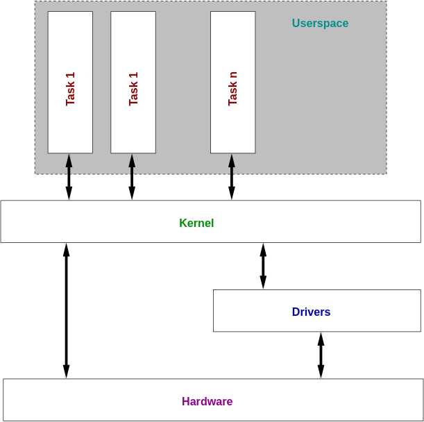

# 作業系統架構

作業系統的架構大概長的像下面張圖這樣

<figure><figcaption>
這是一個作業系統的概念圖，從最上面開始看是使用者的區域(User space)，會有很多任務，這些任務的先後順序跟資源分配都是由系統核心（kernel）完成。核心會直接或透過驅動(Driver)跟硬體溝通，完成使用者想要達成的任務。可以把核心想成一種大型的硬體API
</figcaption></figure>

## 作業系統核心 (Kernel)

所謂的作業系統核心，以下簡稱核心，就是指作業系統。就跟上面那張圖顯示的一樣，核心會跟直接或是透過驅動跟硬體溝通。

核心會抽象化硬體，讓程式可以運行。驅動(Driver)抽象化硬體，讓核心可以運行。舉例來說，我們有很多不同類型的顯示卡，每張顯示卡都有自己硬體上的特色。只要核心提供一個API介面，知道硬體規格的人就可以寫驅動程式來實現這個API，讓核心可以藉由這個API存取各種不同的硬體。

核心通常被稱為特權(privileged)。後面會學到，硬體在多工處理跟系統安全性上，但是這些規則不適用於核心。我們知道核心需要處理當掉的程式(剛剛有提到作業系統的功能就是分配多個任務的資源，但不會保證這個程式的運行狀態，也就是當掉是程式會發生的憾事，作業系統要處能處理)。但是如果作業系統當掉了，那整台電腦都會當掉。同樣的，如果使用者的行程 (process)可以把自己的安全級別提升到kernel等級的權限的話，那 這個程式就能控制整台電腦了。


這段應該是在說核心有特權，安全性跟例外處理是跟一般process完全不同的。


## 單一核心(**Monolithic)?微核心(Microkernels)?**

這個是一個長久以來的爭執，到底是單一核心好，還是微核心好？

單一核心是最常見的，也是被Unix系列(例如Linux)採用的方法。在單一核心的架構下，核心的特權是很大的，包含硬體的驅動，檔案系統，權限管理，網路檔案系統( Network File System, NFS)等等的服務都算在核心的範圍。

單一核心的缺點就是，由於核心擁有特權，掌控整台電腦，核心的任何一個部份當機都會使的整個系統停擺，如果驅動程式有bug，他就能夠成功覆蓋系統中隨便一個位置的記憶體內容，導致系統當機。

所謂微核心的架構就是為了最小化這種可能性，希望核心做的事情越少越好。也就是說，大部分的系統都是執行非特權的程式，從而限制任意一個核心的部份都會造成整台電腦當機的可能性。例如，硬體驅動程式是一個獨立的行程(process），當這個行程發生錯誤的時候，除了他自己當初被分配的那塊記憶體空間以外，他不能覆蓋其他行程的記憶體位置。

那微核心聽起來厲害多了，那還有什麼好吵的？大家主要是在吵

1. 效能會下降，不同組件之間溝通需要時間成本。
2. 對於撰寫程式的人來說，這個架構比較複雜

因為微核心的功能元件化的因素，各個元件(components)需要互相傳遞訊訊息，所以會效能下降，對於程式設計師來說比較複雜。通常這種溝通叫做[行程間通訊](https://zh.wikipedia.org/zh-tw/%E8%A1%8C%E7%A8%8B%E9%96%93%E9%80%9A%E8%A8%8A) (inter-process communication, IPC)。各個模組通訊是用一種離散的方式傳遞。離散的意思是：訊息會先被封裝成一個單位，送給其他模組，然後其他元件需要解碼這段訊息，執行動作，最後再把訊息封裝成一個單位回傳給其他的元件。

這樣子的話，一個很簡單的指令會因為要呼叫外部的元件而產生很多步驟，很明顯的，一個通訊的請求很有可能發起更多的通訊請求，那速度就會降慢很多倍。早期微核心系統因爲訊息傳遞的效率不佳，傳遞資訊的概念對寫程式的人來說又有點難。只是更加多一些的系統安全性而犧牲效能讓微核心系統變得很不流行。

然後在單一核心的系統之中，元件之間的調用就像是一般的函式呼叫。就跟一般軟體的理解一樣。

至於那一個才是比較好的架構，學術上跟非學術上有很多爭論，希望你學完了這些跟作業系統相關的課程之後，你會有你自己的看法。

### **核心模組 Modules**

Linux 核心實做了一個模組系統，也就是說，硬體驅動在需要的時候再動態的載入核心就可以了。這就代表，整個核心很大包的程式碼，其中涵蓋各式各樣不同的驅動程式，並不會全部都載入你的系統，只有你擁有這個硬體，才會載入這段驅動程式。這樣讓某些作業系統開發的人(如RedHat, Debian)可以將大多數的驅動程式包裝成一個個的模組，讓他們的程式可以適應很多不同的硬體。

但是，這些模組都是直接載入核心，也就是擁有跟核心一樣的特權。所以這種系統一樣被視為是單一核心。


翻譯上 module 跟 component 都筆者都將其翻譯成模組，語意上沒有區分

[https://stackoverflow.com/questions/2702816/module-vs-component-design](https://stackoverflow.com/questions/2702816/module-vs-component-design)


## **虛擬化 (Virtualisation)**

另外一個跟核心相關的概念就是硬體的虛擬化。現代的電腦效能非常的好，所以通常為把物理上的一台電腦，拆分成很多虛擬的電腦，每一個虛擬電腦都互相不影響，可以獨立完成任務，但實際上都是同一台電腦。

<figure><figcaption></figcaption></figure>

這個可以有很多種虛擬化的方法，最簡單的例子就是，虛擬器監視器(_virtual machine monitor, VMM, hypervisor_)，這個VMM會在直接運行在硬體上面，然後提供界面給客戶端的作業系統。客戶端的作業系統根本不知道有沒有VMM的存在，因為VMM長的就像一個硬體界面，他會攔截客戶端作業系統傳給硬體的訊息，然後動點手腳，或使只分配一部分的硬體資源給這個客戶端系統這樣。

這種作法通常用於大型的電腦(那種有很多CPU跟記憶體的那種電腦)，這樣做可以實現分割(partitioning)，也就是把機台拆分成很多小的虛擬機，當需要比較多計算量的時候，VMM可以動態的分配更多資源給虛擬機。許多大型的IBM伺服器都擁有這種功能，這種功能其實很複雜(上百萬行程式碼)，提供大量的伺服器管理服務。

另外一種作法就是讓作業系統知道vmm的存在，然後透過vmm存取硬體資源。這種方法被稱為半虛擬化(_paravirtualisation)，_&#x65E9;期Xen系統就是用這種方式作為一個折衷的方案。希望這樣可以提供更好的效能，因為作業系統需要明確的要求vmm給予系統支援，而不是由 vmm 動態的解決分配資源的問題。

最後，還有一種情況是這樣：在現有的作業系統上面運行一個應用程式，這個應用程式就是一個虛擬化的作業系統(裡面包含CPU, 記憶體, 硬碟空間等)。這個應用程式會自己的虛擬作業系統裡面的應用程式的請求藉由現有的作業系統呼叫硬體，這個大概就是 VMWare 的工作原理。這種方法有很多成本(overheads)，因為這個應用程式需要模擬整個作業系統的運作，然後把應用層的請求轉換成底層的硬體操作。但是，這個可以讓我們在同一台電腦上模擬各種不同的作業系統，因為我們可以動態的翻譯不同的處理器的CPU 指令。(這就跟 Rosetta 從powerPC處理器到 intel 處理器，到ARM處理器都能使用的感覺)

最后，您可能遇到这样的情况：在现有操作系统之上运行的应用程序提供了可以运行普通操作系统的虚拟化系统（包括 CPU，内存，BIOS，磁盘等）。应用程序通过现有操作系统将请求转换为底层硬件。这类似于 VMWare 的工作方式。这种方法有很多开销，因为应用程序进程必须模拟整个系统并将所有内容转换为来自底层操作系统的请求。但是，这使您可以一起模拟完全不同的体系结构，因为您可以将指令从一种处理器类型动态转换为另一种处理器类型（因为 Rosetta 系统使用从 PowerPC 处理器转移到基于 Intel 的处理器的 Apple 软件）。

在使用任何这些虚拟化技术时，性能是主要问题，因为曾经直接在硬件上进行快速操作需要通过抽象层来实现。

英特尔已经讨论了即将推出最新处理器的虚拟化硬件支持。这些扩展通过为可能需要介入虚拟机监视器的操作引发特殊异常来工作。因此，处理器看起来与运行在其上的应用程序的非虚拟化处理器相同，但是当该应用程序请求可能在其他客户机操作系统之间共享的资源时，可以调用虚拟机监视器。

这提供了卓越的性能，因为虚拟机监视器不需要监视每个操作以查看它是否安全，但可以等到处理器通知发生了不安全的事情。

Finally, you may have a situation where an application running on top of the existing operating system presents a virtualised system (including CPU, memory, BIOS, disk, etc) which a plain operating system can run on. The application converts the requests to hardware through to the underlying hardware via the existing operating system. This is similar to how VMWare works. This approach has many overheads, as the application process has to emulate an entire system and convert everything to requests from the underlying operating system. However, this lets you emulate an entirely different architecture all together, as you can dynamically translate the instructions from one processor type to another (as the Rosetta system does with Apple software which moved from the PowerPC processor to Intel based processors).

Performance is major concern when using any of these virtualisation techniques, as what were once fast operations directly on hardware need to make their way through layers of abstraction.

Intel have discussed hardware support for virtualisation soon to be coming in their latest processors. These extensions work by raising a special exception for operations that might require the intervention of a virtual machine monitor. Thus the processor looks the same as a non-virtualised processor to the application running on it, but when that application makes requests for resources that might be shared between other guest operating systems, the virtual machine monitor can be invoked.

This provides superior performance because the virtual machine monitor does not need to monitor every operation to see if it is safe, but can wait until the processor notifies that something _unsafe_ has happened.

**2.1.2.1 Covert Channels**

This is a digression, but an interesting security flaw relating to virtualised machines. If the partitioning of the system is not static, but rather _dynamic_, there is a potential security issue involved.

In a dynamic system, resources are allocated to the operating systems running on top as required. Thus if one is doing particularly CPU intensive operations whilst the other is waiting on data to come from disks, more of the CPU power will be given to the first task. In a static system, each would get 50% an the unused portion would go to waste.

Dynamic allocation actually opens up a communications channel between the two operating systems. Anywhere that two states can be indicated is sufficient to communicate in binary. Imagine both systems are extremely secure, and no information should be able to pass between one and the other, ever. Two people with access could collude to pass information between themselves by writing two programs that try to take large amounts of resources at the same time.

When one takes a large amount of memory there is less available for the other. If both keep track of the maximum allocations, a bit of information can be transferred. Say they make a pact to check every second if they can allocate this large amount of memory. If the target can, that is considered binary 0, and if it can not (the other machine has all the memory), that is considered binary 1. A data rate of one bit per second is not astounding, but information is flowing.

This is called a _covert channel_, and whilst admittedly far-fetched there have been examples of security breaches from such mechanisms. It just goes to show that the life of a systems programmer is never simple!

#### 2.2 Userspace

We call the theoretical place where programs are run by the user _userspace_. Each program runs in userspace, talking to the kernel through _system calls_ (discussed below).

As previously discussed, userspace is _unprivileged_. User programs can only do a limited range of things, and should never be able to crash other programs, even if they crash themselves.

