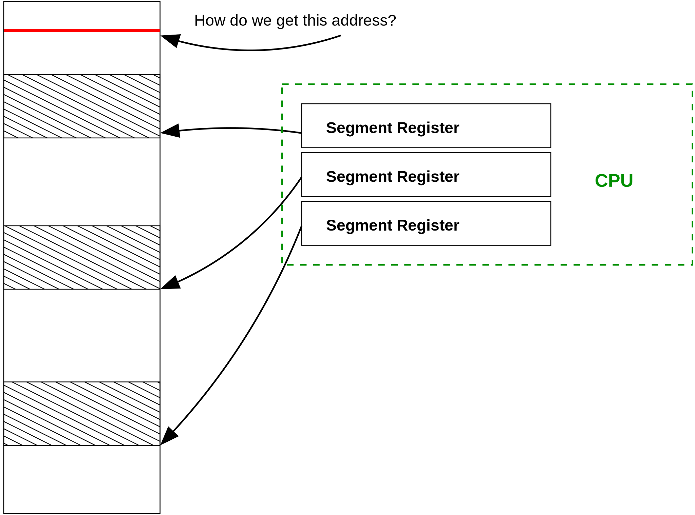

# 硬體支援

到目前為止，我們只提到硬體與作業系統一起實作出虛擬記憶體。我們現在終於可以一窺究竟虛擬記憶體是怎麼實作的。

虛擬記憶體大多是跟硬體架構高度相關，每個架構都有自己的微妙之處。但他們有一些共同的元素，後面會介紹給你聽聽。

## 物理/虛擬 記憶體模式

所有處理器都有兩種記憶體模式的概念，要麻是物理模式，要麻虛擬記憶體模式。在物理模式下，硬體會期望地址就是真實的記憶體位置；在虛擬模式下，硬體知道需要翻譯之後才會是真實的記憶體位置。

在許多處理器中，這兩種模式被簡單地稱為物理模式和虛擬模式，例如 intel Itanium 架構。而在最常見的 x86 處理器中，因為一些歷史的包袱，這兩個模式被稱為真實（ real） 跟保護（ _protected）_&#x6A21;式。第一個實現保護模式的是 i386 ，直到現在最新的 x86 仍然可以執行 real mode (雖然說沒有人這樣使用)。在 真實模式下，處理器會實施一種記憶體的分割，叫做 segmentation 。


關於 x86 的 real mode 的 segmentation

[https://en.wikipedia.org/wiki/X86\_memory\_segmentation#Real\_mode](https://en.wikipedia.org/wiki/X86_memory_segmentation#Real_mode)


### &#x20;**Segmentation 的問題？**

這個「**Segmentation**」就是一個有趣的歷史故事而已，因為現在已經有虛擬記憶體的概念了。segmentation 有一些缺點，他會使沒有什麼經驗的程式設計師感到非常困惑，所以才發明了虛體記憶體的這個機制。

在 segmentation 中，會有許多的暫存器儲存「一段記憶體 segment 的開頭地址」，如果你想知道地址的話，你就必須知道你要找的資料在哪一個 segment ，找到相對應的暫存器，然後加上 offset 才會是你想要的地址。segment 的大小你可以決定，但基本上取決於暫存器中可用的 bit 數量有關。在 x86 架構中，最大的大小是 64 KB(16bit)，如果你想要存取大於 64 KB 的地址的話，就會造成系統大崩潰。但是現代的記憶體都是 MB 等級、GB 等級的記憶體。現在已經不是小小的不方便而已

<figure><figcaption>
這邊在講說，在 segment 的模式下，CPU的暫存器會存放每一個 segment 的開頭位置，每一個大小最大可能是 64 KB，要讀取記憶體地址的話，就是先找到那個 segment 的開頭，然後加上一個 offset。啊如果你超過每個 segment 的大小，也就是你想要讀這個 segment 然後 offset = 128KB 系統就會大爆炸。
</figcaption></figure>

在上面這張圖中，有三個暫存器，都指向 segment ，受到可用 bit 數影響的最大 offset用斜線表示。如果程式想要存取超過此範圍的地址，必須要重新配置 segment 暫存器。這個就變成一個很大的煩惱。另一方面，虛擬記憶體允許程式可以指定任何的地址，然後作業系統跟硬體可以努力的翻譯虛擬地址到真實的記憶體位置。&#x20;

## 什麼是 TLB？

轉譯後備緩衝區（The _Translation Lookaside Buffer, TLB）_ 是處理器主要負責虛擬記憶體的元件。他是虛擬 page 對應到真實記憶體 frame 的表格的快取，作業系統跟硬體一起管理這個 TLB

### **Page Faults**

當硬體收到一個虛擬地址的時候，假設現在是透過 `load` 指令想要獲得一些資料，處理器會先看看 TLB 有沒有這段虛擬地址的對應關係，如果有的話，那他就可以直接依據這個資訊，跟 offset ，直接找到物理社的位置，然後直接完成 load 的動作。

但是，如果處理器在 TLB 中找不到對應關係，那處理器就會發起一個 「_page fault_」，這個類似一個作業系統必須處理的中斷（跟前面討論的一樣）然後作業系統就必須處理這件事情。

當作業系統收到 _page fault_ 的時候，他需要透過 page table 去找到正確的 page 跟 frame 的對應關係，然後把這個關係插入 TLB 裡面。

如果作業系統在 page table 中找不到對應關係，或者作業系統檢查到這個 process 無權訪問這張 page 的記憶體內容，那作業系統就必須停止(kill) 這個 process。如果你曾經看過「segmentation fault (segfault)」 ，這就是作業系統停止一個 process 越界存取記憶體的意思。

如果找到對應關係，但是 TLB 已經滿了，這個時候在插入這個對應關係之前，要先刪掉另外一組。通常我們會刪除等等用不太到的那組，因為如果的等就要用到我們還要花時間去查  page table 。所以我們會用一些演算法，例如最近最久未使用演算法（_Least Recently Used,_ LRU），把其中最古老的，最少用到的那組給踢出，取而代之的是最新的翻譯。

然後這個過程就會重複的出現，如果事情順利的話，那後來會在 TLB 找到虛擬記憶體跟實際記憶體的對應關係。


最近最久未使用演算法，就是把最不常用的到刪掉，大部分的人翻譯成最近最少使用法，感覺比較像是英文直接翻譯，沒有翻到意義。

[https://zhuanlan.zhihu.com/p/31997704](https://zhuanlan.zhihu.com/p/31997704)


#### **怎麼找到 page table？**

當我們說，作業系統會從 page table 中找到虛擬記憶體跟實體記憶體的對應關係的時候，我們應該問問作業系統是如何找到 page table 的？ page table 在記憶體的哪裡？

page table 的地址被儲存在每個有關連的 process 的暫存器裡面。通常這個暫存器會被叫做「page-table base-register 」，利用這個暫存器跟第幾張 page 這兩個資訊，就可以找到正確的 page table&#x20;

#### **其他跟 page 相關的錯誤**

TLB 通常還有兩種常見的出錯，這種錯誤訊息有助於管理存取控制，跟被修改過的 page (dirty page)。每一張 page 都有某種形式的屬性，例如用一個 bit 去標記這個 page 是否被存取過，或者是修改過。

一個被存取過的 page 指的是這個 page 跟 frame 的對應關係已經存在 TLB 上。那這個 page 就會被標記成 accessed  。

作業系統可以定期檢查所有的 page ，刪除掉一些 accessed bit 以了解現在哪些 page 有被使用中。當主記憶體快要滿了的時候，作業系統可以選擇這些沒有「已存取標記」的 page 交換到硬碟之中，因為他們很久沒有被用到了。

一個髒的 page ，就是有寫入資料的 page 。所以硬碟上的那份備份就跟記憶體上面的那份不匹配。例如，如果一張 page 從硬碟被交換出來，然後被一個 process 改寫，那要記得在下一次 swap 之前，更新硬碟裡面的備份。那如果這個 page 不是髒（dirty）的。那我們就不需要花時間成本去將這個 page 複製到硬碟之中。

兩者的概念很相近，因為他們可以幫助作業系統管理 page 。一般的概念就是，一個 page 會多兩個 bits。一個代表 accessed 一個代表 dirty。當一張 page 被放到 TLB 的時候，CPU 會檢查這些 bits 然後看要不要發出一個錯誤訊息。

當一個 process 想要存取記憶體的時候，硬體會執行常規的翻譯。然後，他還會做一些額外的檢查，檢查是不是有 accessed bit。如果沒有的話，那就會發起一個錯誤訊息。告訴作業系統，這個 bit 應該要被舉起來，才能允許這個 process 繼續做下去。相同的，如果硬體發現這張 page 被寫過了，但是 dirty bit 沒有被舉起來，那他就會發起一個錯誤訊息，告訴作業系統，這張 page 應該要舉 dirty。

## TLB 管理

我們可以這樣理解，TLB 是給硬體使用的，但是是由軟體管理。作業系統需要負責正確的對應關係載入 TLB和把不要的對應關係刪掉。

### **Flushing TLB**

這個把 TLB 的內容移除的動作叫做 「_flushing_」。更新 TLB 是維護每一個 process 的地址的重要步驟。因為每一個 process 都使用相同的虛擬地址範圍，而且不更新 TLB 的話，那就會有一個 process 覆蓋到另外一個 process 的記憶體（相反的，在 thread 共享記憶體空間，這種時候你就不會 flush TLB，因為這個就是你想要的性質）。

這某些處理器上，只要有「context switch」，整個 TLB 就會更新。這個是很花時間的，因為這件事情代表說新的 process 需要經歷 page fault -> 從 page table 找到對應關係 ->  對應關係載入 TLB 這個漫長的路。

其他處理器會實作一個東西叫做 「extra _address space ID_ (ASID)」這些 ASID 會被新增到 TLB 的每一個地址之中。這就讓每一個地址空間(通常是在說 process，因為 thread 共享記憶體空間。)都有自己獨特的ID ，這個 ID 會跟著對應關係一起儲存在 TLB 之中。所以在 context switch 的時候就不需要更新整個 TLB 表格，因為下一個 process 會有另外的一個地址空間的 ID ，所以就算下一個 process 要求存取同一個虛擬記憶體的位置，因為 ASID 的關係，翻譯之後他們會對應到不同的物理記憶體位置。這個架構節省了更新 TLB 的時間，增進了系統的效能，缺點就是他需要更多的 TLB 硬體來儲存這些 ASID bit 。

一般來說，這個是透過一個額外的暫存器來實作的。這個暫存器是某個 process 的狀態，這個狀態包含 ASID 。當要進行虛擬地址轉換到真實記憶體位置的活動的時候，TLB 會去看這個暫存器的數值，找到符合現在這個 process 的 ASID 才會用這個做翻譯。當然，暫存器的 bit 數量會影響到實際上有幾個 ASID 可以使用，因此會影響效能，可以參考下一個小節會有「補上 section 10 」 的範例說明。

### **軟/硬體載入 TLB**

雖然說最後都是作業系統掌控整個 TLB 。但這個只是部分的處理而已。在剛剛有提到（[page fault](hw_support.md#page-faults)）描述了 page fault 是如何被作業系統處理的，發生 page fault -> OS 遍歷 page table 找關係 -> 關係寫入 TLB 這個流程稱為「軟體載入的 TLB」，但其實我們還有硬體載入 TLB 的選項。

在硬體載入 TLB 的選項裡，處理器的架構會定義 page table 的格式，這樣才能做虛擬地址的轉換。在虛擬地址沒有在 TLB 的況下，處理器會自動遍歷整張 page table 然後載入正確的對應關係到 TLB 之中。只有在 page table 也找不到的情況下，處理器才會發出異常，請作業系統處理。

硬體遍歷 page table 有速度上的優勢，但是會讓作業系統的實作變得比較受限。

大致上的架構都可以被分類成這兩個方法，後面我們會帶大家看看一般架構是如何實現虛擬地址的。

