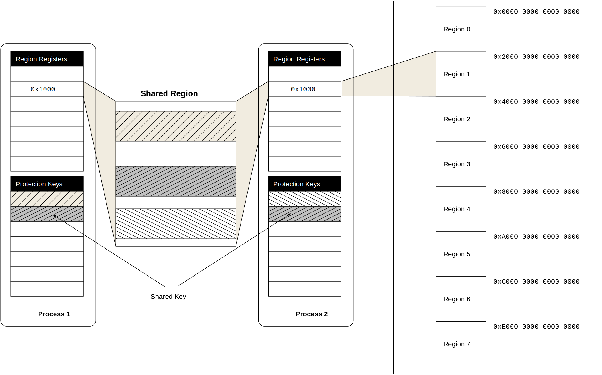
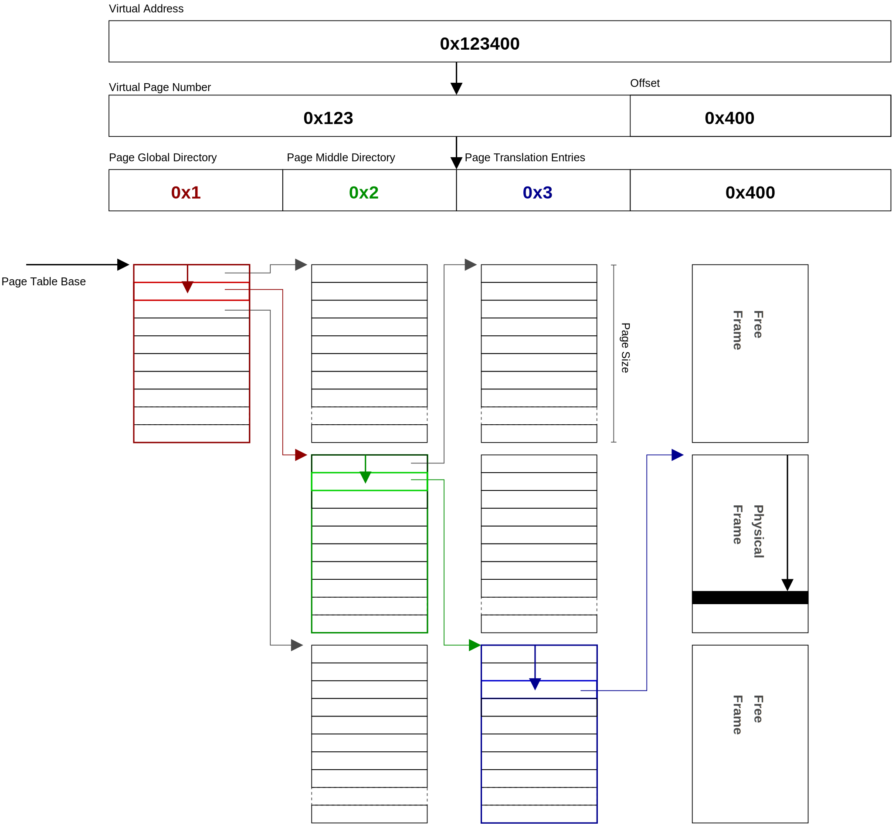
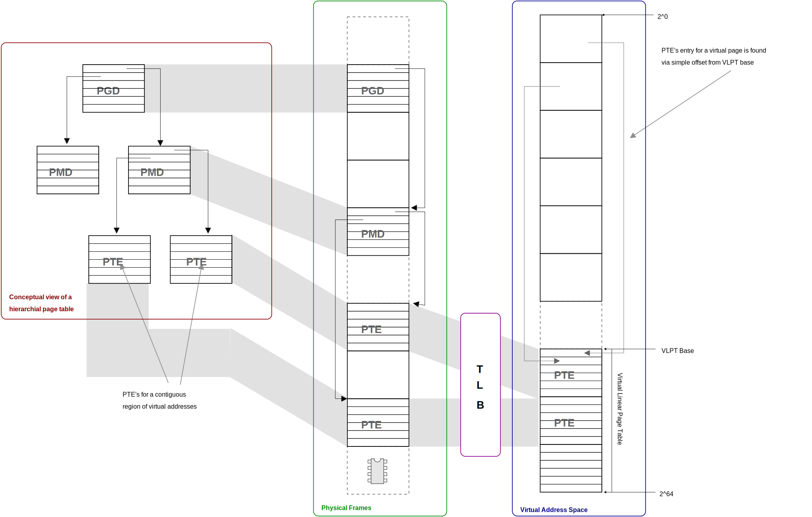

# 詳細硬體支援

如同我們之前有提到的，處理器跟硬體會共同做到查詢虛擬記憶體到實體記憶體的工作，每個處理器架構都有自及的處裡方式，有各自的優點跟缺點。

這邊跳過 x86-64 這個架構的說明。先說明  Itanium 的架構是怎麼處理的。

## Itanium

Itanium 記憶體管理(MMU)提供了很多有趣的功能給作業系統使用

## **Address spaces**

在 Flush TLB 那邊有介紹到 _address-space ID (ASID)_ 的概念，有了這個我們就可以減少 context switching 的時間。但是，寫程式的人會使用 thread 來共享某些記憶體空間。thread 擁有一樣的 ASID，也就是一樣的 TLB，這樣可以增加系統效能。但是這種分享會阻止記憶體保護的概念，分享同樣的記憶體空間就代表根本沒有記憶體保護，哪怕只是幾個 byte 大家都可以不安全的存取對方的記憶體內容。

<figure><figcaption></figcaption></figure>

The Itanium MMU considers these problems and provides the ability to share an address space (and hence translation entries) at a much lower granularity whilst still maintaining protection within the hardware. The Itanium divides the 64-bit address space up into 8 _regions_, as illustrated in [Figure 10.2.1.1, Illustration Itanium regions and protection keys](https://www.bottomupcs.com/ch06s10.html#ia64\_regions\_keys). Each process has eight 24-bit _region registers_ as part of its state, which each hold a _region ID_ (RID) for each of the eight regions of the process address space. TLB translations are tagged with the RID and thus will only match if the process also holds this RID, as illustrated in [Figure 10.2.1.2, Illustration of Itanium TLB translation](https://www.bottomupcs.com/ch06s10.html#ia64\_tlb\_translation).

Further to this, the top three bits (the region bits) are not considered in virtual address translation. Therefore, if two processes share a RID (i.e., hold the same value in one of their region registers) then they have an aliased view of that region. For example, if process-A holds RID `0x100` in region-register 3 and process-B holds the same RID `0x100` in region-register 5 then process-A, region 3 is aliased to process-B, region 5. This limited sharing means both processes receive the benefits of shared TLB entries without having to grant access to their entire address space.

**10.2.1.1 Protection Keys**

To allow for even finer grained sharing, each TLB entry on the Itanium is also tagged with a _protection key_. Each process has an additional number of _protection key registers_ under operating-system control.

When a series of pages is to be shared (e.g., code for a shared system library), each page is tagged with a unique key and the OS grants any processes allowed to access the pages that key. When a page is referenced the TLB will check the key associated with the translation entry against the keys the process holds in its protection key registers, allowing the access if the key is present or otherwise raising a _protection_ fault to the operating system.

The key can also enforce permissions; for example, one process may have a key which grants write permissions and another may have a read-only key. This allows for sharing of translation entries in a much wider range of situations with granularity right down to a single-page level, leading to large potential improvements in TLB performance.

**10.2.2 Itanium Hardware Page-Table Walker**

Switching context to the OS when resolving a TLB miss adds significant overhead to the fault processing path. To combat this, Itanium allows the option of using built-in hardware to read the page-table and automatically load virtual-to-physical translations into the TLB. The hardware page-table walker (HPW) avoids the expensive transition to the OS, but requires translations to be in a fixed format suitable for the hardware to understand.

The Itanium HPW is referred to in Intel's documentation as the _virtually hashed page-table walker_ or VHPT walker, for reasons which should become clear. Itanium gives developers the option of two mutually exclusive HPW implementations; one based on a virtual linear page-table and the other based on a hash table.

It should be noted it is possible to operate with no hardware page-table walker; in this case each TLB miss is resolved by the OS and the processor becomes a software-loaded architecture. However, the performance impact of disabling the HPW is so considerable it is very unlikely any benefit could be gained from doing so

**10.2.2.1 Virtual Linear Page-Table**

The virtual linear page-table implementation is referred to in documentation as the _short format virtually hashed page-table_(SF-VHPT). It is the default HPW model used by Linux on Itanium.

The usual solution is a multi-level or hierarchical page-table, where the bits comprising the virtual page number are used as an index into intermediate levels of the page-table (see [Section 9.2, Three Level Page Table](https://www.bottomupcs.com/ch06s09.html#three\_level\_page\_table)). Empty regions of the virtual address space simply do not exist in the hierarchical page-table. Compared to a linear page-table, for the (realistic) case of a tightly-clustered and sparsely-filled address space, relatively little space is wasted in overheads. The major disadvantage is the multiple memory references required for lookup.

<figure><figcaption></figcaption></figure>

\
With a 64-bit address space, even a 512\~GiB linear table identified in [Section 6.3, Virtual Address Translation](https://www.bottomupcs.com/ch06s06.html#virtual\_address\_translation) takes only 0.003% of the 16-exabytes available. Thus a _virtual linear page-table_ (VLPT) can be created in a contiguous area of _virtual_address space.

Just as for a physically linear page-table, on a TLB miss the hardware uses the virtual page number to offset from the page-table base. If this entry is valid, the translation is read and inserted directly into the TLB. However, with a VLPT the address of the translation entry is itself a virtual address and thus there is the possibility that the virtual page which it resides in is not present in the TLB. In this case a _nested fault_ is raised to the operating system. The software must then correct this fault by mapping the page holding the translation entry into the VLPT.

<figure><figcaption></figcaption></figure>

This process can be made quite straight forward if the operating system keeps a hierarchical page-table. The leaf page of a hierarchical page-table holds translation entries for a virtually contiguous region of addresses and can thus be mapped by the TLB to create the VLPT as described in [Figure 10.2.2.1.2, Itanium short-format VHPT implementation](https://www.bottomupcs.com/ch06s10.html#ia64\_short\_format).

\

<figure><figcaption></figcaption></figure>

The major advantage of a VLPT occurs when an application makes repeated or contiguous accesses to memory. Consider that for a walk of virtually contiguous memory, the first fault will map a page full of translation entries into the virtual linear page-table. A subsequent access to the next virtual page will require the next translation entry to be loaded into the TLB, which is now available in the VLPT and thus loaded very quickly and without invoking the operating system. Overall, this will be an advantage if the cost of the initial nested fault is amortised over subsequent HPW hits.

The major drawback is that the VLPT now requires TLB entries which causes an increase on TLB pressure. Since each address space requires its own page table the overheads become greater as the system becomes more active. However, any increase in TLB capacity misses should be more than regained in lower refill costs from the efficient hardware walker. Note that a pathological case could skip over `page_size` ÷ `translation_size` entries, causing repeated nested faults, but this is a very unlikely access pattern.

The hardware walker expects translation entries in a specific format as illustrated on the left of [Figure 10.2.2.1.3, Itanium PTE entry formats](https://www.bottomupcs.com/ch06s10.html#ia64\_ptes). The VLPT requires translations in the so-called 8-byte _short format_. If the operating system is to use its page-table as backing for the VLPT (as in [Figure 10.2.2.1.2, Itanium short-format VHPT implementation](https://www.bottomupcs.com/ch06s10.html#ia64\_short\_format)) it must use this translation format. The architecture describes a limited number of bits in this format as ignored and thus available for use by software, but significant modification is not possible.

A linear page-table is premised on the idea of a fixed page size. Multiple page-size support is problematic since it means the translation for a given virtual page is no longer at a constant offset. To combat this, each of the 8-regions of the address space ([Figure 10.2.1.1, Illustration Itanium regions and protection keys](https://www.bottomupcs.com/ch06s10.html#ia64\_regions\_keys)) has a separate VLPT which only maps addresses for that region. A default page-size can be given for each region (indeed, with Linux HugeTLB, discussed below, one region is dedicated to larger pages). However, page sizes can not be mixed within a region.

**10.2.2.2 Virtual Hash Table**

Using TLB entries in an effort to reduce TLB refill costs, as done with the SF-VHPT, may or may not be an effective trade-off. Itanium also implements a _hashed page-table_ with the potential to lower TLB overheads. In this scheme, the processor_hashes_ a virtual address to find an offset into a contiguous table.

The previously described physically linear page-table can be considered a hash page-table with a _perfect_ hash function which will never produce a collision. However, as explained, this requires an impractical trade-off of huge areas of contiguous physical memory. However, constraining the memory requirements of the page table raises the possibility of collisions when two virtual addresses hash to the same offset. Colliding translations require a _chain_ pointer to build a linked-list of alternative possible entries. To distinguish which entry in the linked-list is the correct one requires a _tag_ derived from the incoming virtual address.

The extra information required for each translation entry gives rise to the moniker _long-format_\~VHPT (LF-VHPT). Translation entries grow to 32-bytes as illustrated on the right hand side of [Figure 10.2.2.1.3, Itanium PTE entry formats](https://www.bottomupcs.com/ch06s10.html#ia64\_ptes).

The main advantage of this approach is the global hash table can be pinned with a single TLB entry. Since all processes share the table it should scale better than the SF-VHPT, where each process requires increasing numbers of TLB entries for VLPT pages. However, the larger entries are less cache friendly; consider we can fit four 8-byte short-format entries for every 32-byte long-format entry. The very large caches on the Itanium processor may help mitigate this impact, however.

One advantage of the SF-VHPT is that the operating system can keep translations in a hierarchical page-table and, as long as the hardware translation format is maintained, can map leaf pages directly to the VLPT. With the LF-VHPT the OS must either use the hash table as the primary source of translation entries or otherwise keep the hash table as a cache of its own translation information. Keeping the LF-VHPT hash table as a cache is somewhat sub-optimal because of increased overheads on time critical fault paths, however advantages are gained from the table requiring only a single TLB entry.
