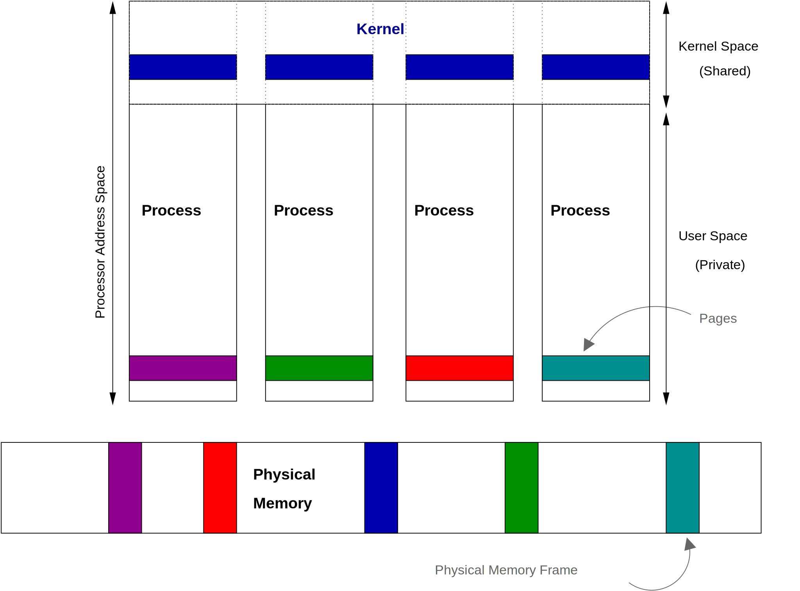
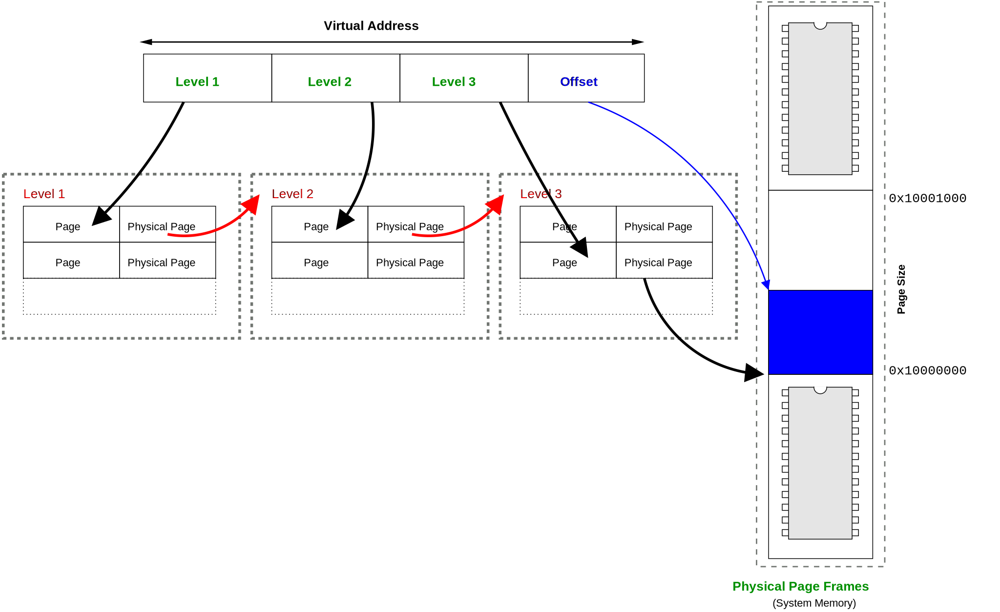

# Linux 的虛擬記憶體

雖然說虛擬記憶體的概念都差不多，但是實作上還是強烈的跟作業系統跟硬體相關。

## 地址空間的佈局

Linux 會將可用的地址空間切成兩個部分，一個部分是核心使用、一個部分是私有使用者空間。這個就代表，核心的地址空間對於每個 process 來說都是映射到同一個物理記憶體的位置，但是使用者空間的地址是每個 process 讀自擁有的。在 Linux 中，核心的地址空間在非常上面的位置，一般 32bit x86 系統，大概就會分在 3GB 那那個位置，因為 32 bit 最多就是 4GB 記憶體，核心保留 1 GB 作為核心共享的記憶體空間。


這個是一個過度簡化的說明，因為會有 process 需要超過 4GB以上的記憶體空間，這個你就自己在調查一下要怎麼使用特殊的 extensions 支援 > 4GB 的記憶體空間。


<figure><figcaption>
這張圖在說明(1) 所有 process 都共用一個核心的記憶體空間，(2) 核心的記憶體空間對應到的位置都是同一個物理上的記憶體位置，(3) 每個 process 都有自己的記憶體空間，然後對應到不同的物理記憶體位置。 
</figcaption></figure>

## 三層 Page Table

作業系統有許多不同的方法來組織 page talbe，但 linux 選擇使用分層系統( _hierarchical_ system )

由於 page table 使用分層的結構

\

As the page tables use a hierarchy that is three levels deep, the Linux scheme is most commonly referred to as the _three level page table_. The three level page table has proven to be robust choice, although it is not without its criticism. The details of the virtual memory implementation of each processor vary Whitley meaning that the generic page table Linux chooses must be portable and relatively generic.

由於頁面表使用三級深度的層次結構，Linux方案通常被稱為_三級頁面表_。 事實證明，三級頁面表是一個強大的選擇，儘管它並非沒有批評。 每個處理器的虛擬記憶體實現細節各不相同，惠特利意味著Linux選擇的通用頁面表必須是可移植的，並且相對通用。

The concept of the three level page table is not difficult. We already know that a virtual address consists of a page number and an offset in the physical memory page. In a three level page table, the virtual address is further split up into a number _levels_.

三級頁表的概念並不難。 我們已經知道，虛擬地址由物理記憶體頁面中的頁碼和偏移量組成。 在三級頁面表中，虛擬地址進一步拆分為數字_級別_。

Each level is a page table of its own right; i.e. it maps a page number of a physical page. In a single level page table the "level 1" entry would directly map to the physical frame. In the multilevel version each of the upper levels gives the address of the physical memory frame holding the next lower levels page table.

每個級別本身就是一個頁面表；即它對映物理頁面的頁碼。 在單個級別的頁面表中，“級別1”條目將直接對映到物理幀。 在多級版本中，每個上層都提供了物理記憶體幀的地址，該幀儲存了下一個較低級別頁面表。

<figure><figcaption></figcaption></figure>

So a sample reference involves going to the top level page table, finding the physical frame that the next level address is on, reading that levels table and finding the physical frame that the next levels page table lives on, and so on.

At first, this model seems to be needlessly complex. The main reason this model is implemented is for size considerations. Imagine the theoretical situation of a process with only one single page mapped right near the end of its virtual address space. We said before that the page table entry is found as an offset from the page table base register, so the page table needs to be a contiguous array in memory. So the single page near the end of the address space requires the entire array, which might take up considerable space (many, many physical pages of memory).

In a three level system, the first level is only one physical frame of memory. This maps to a second level, which is again only a single frame of memory, and again with the third. Consequently, the three level system reduces the number of pages required to only a fraction of those required for the single level system.

There are obvious disadvantages to the system. Looking up a single address takes more references, which can be expensive. Linux understands that this system may not be appropriate on many different types of processor, so each architecture can_collapse_ the page table to have less levels easily (for example, the most common architecture, the x86, only uses a two level system in its implementation).

\
