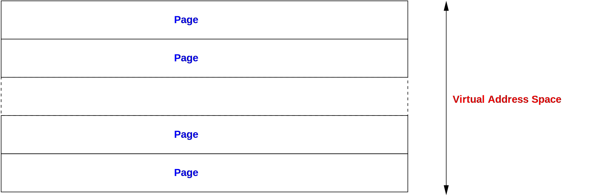

# Page and Frame

## Pages

所以都地址空間都會被分成一塊一塊的 page。 page 可以有很多的大小，但是通常是 4KiB 這個大小。這不是一定要這樣做的規則， 每一個 page 的大小可以更大，但是通常不會更小。page 就是作業系統跟硬體最小可以處理的記憶體單位。&#x20;

此外，作業系統會在每一個 page 上面設定一些屬性。一般會有可讀、可寫、可以執行之類的權限屬性。舉個例子來說，作業系統通常會標記哪一張 page 是 process 的程式碼，並且標記這張 page 是可執行。處理器就可以借此來避免執行到不是程式碼的記憶體內容。就是，如果沒有可執行的標記，處理器就不要執行這段程式碼。

<figure><figcaption></figcaption></figure>

這時候寫程式的人可能會有些疑問，我明明可以宣告一個比 4 KiB 更小的記憶體空間，例如使用 `malloc`或類似的函式呼叫就可以配置少量的記憶體。 heap 記憶體也是以 page 做分配的，不過 `malloc`會讓你用比較有效率的方式去管理這些記憶體分配

## 實體記憶體(Physical)

就像作業系統會把地址空間劃分成一張一張的 page，實體記憶體也會被劃分成一張一張的 frame 。這個 frame 是慣用的專有名詞，描述跟 page 一樣大的物理記憶體大小。

作業系統會維護一張表( _frame-table_ )，這張表會紀錄所有可能的實體記憶體、以及這些記憶體是不是可以被使用(free)。當我們給 process 分配一段記憶體的時候，那段地址就會在frame-table中被標記成已使用。用這樣子的方式，作業系統就可以知道現在有哪些記憶體被分配出去了。

那作業系統怎麼知道有多少記憶體可以使用？在初始化的時候，BIOS 會將哪段記憶體位置可以使用、記憶體的大小、屬性等等的資訊都傳給作業系統。

## Pages + Frames = Page Tables

作業系統會負責幫你記錄與追蹤這張 page 對應到哪一張 Frames。並且把這些資訊都記錄在_page-table_ 裡面。如果是最簡單的形式，如果是一對一的對應的話，被叫做_linear page-table_。也就是在 32bit 的地址空間中，要對應 4KiB 的 page ，需要紀錄一百多萬筆對應關係(1048576 = 2^20)，也就是說這張表格的大小就是一百多萬行，每一行都是一個 page 跟 frame 的對應關係。

這張Page tables 對應表可以有很多不同最佳化的結構，不然從一百萬筆找到相對應的資料會是一個很漫長的時間，稍後我們會將更深入的探究這個議題。

作業系統會獨家的掌控這張 page tables 對應表，當一個 process 要求作業系統分配一個記憶體空間的時候，作業系統會找到可以使用的記憶體位置，然後紀錄這個虛體記憶體到真實物理上的記憶體的對應關係，把這個關係寫在 page tables 對應表上。當一個 process 放棄這段記憶體空間的時候，作業系統會將此對應關係在 page tables 上面刪除，這樣作業系統就會覺得那段記憶體是可以被分配給其他的 process。這也就是為什麼當我們新拿到一個記憶體位置的時候，上面會有一些殘留的資料的原因

