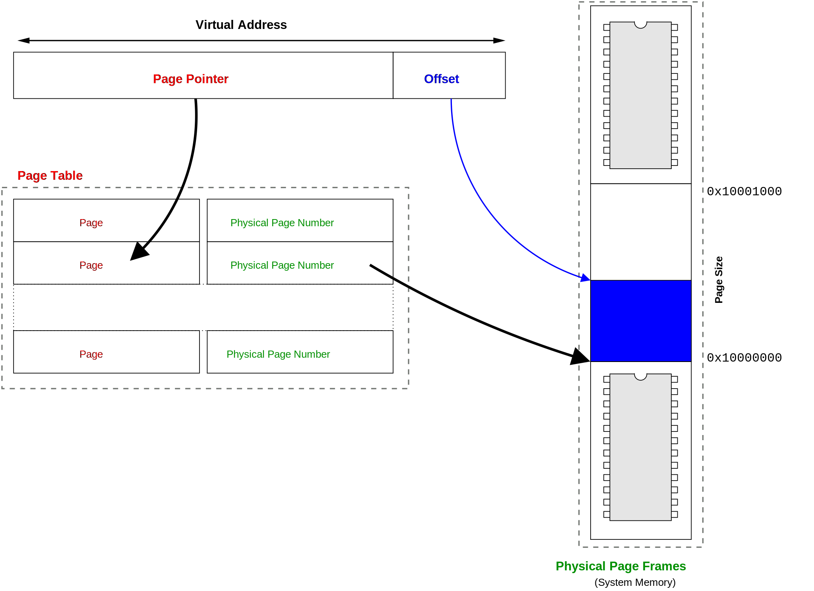

# 虛體地址（Virtual Addresses）

當我們的程式存取記憶體的時候，他不知道，也不會在乎這個地址的實體位置儲存在哪裡。因為程式知道真實的記憶體位置是由作業系統跟硬體一起去找到的，並且提供給程式他想要的資料。所以我們將程式使用的記憶體地址稱為「_虛擬地址(virtual address)_」，那這個虛擬地址什麼樣子呢？他有兩個部分，一個叫做 page 一個叫做 offset 。

## Page

因為整個地址空間都被切割成某個特定大小的 page ，所以每一個可能的地址都會是在某一張 page 裡面。所以虛擬地址中的 page 代表的就是 page table 裡面的索引，也就是第幾張 page 的意思。由於 page 是作業系統裡面最小的記憶體分配的單位，所以如果每一張 page 很小，那作業系統就必須管理一個數量很大的 page tables 。但如果每一張 page 很大，那可能會浪費記憶體空間。這個就交給大家去權衡一下。

## Offset

虛擬地址的最後幾個 bit 就被稱為偏移量(offset)。就是指你想要的地址到這張 page 開頭差了幾個 byte 。你需要足夠的 bit 數量才可以抵達任何一個 byte 。也就是説，對於一個 4KB 的 page ，你需要 12 個 bit 的 offset 才足夠描述 4KB( 2^12) 的地址。請記得，作業系統與硬體處理的最小的單位就是 page，這 4096 byte 都在同一個 page 裡頭，被當成一個物件來處理。

虛擬地址的最後一點稱&#x70BA;_&#x504F;移量_，即您想要的位元組地址與頁面開頭之間的位置差異。 您需要偏移量足夠的位數才能到達頁面中的任何位元組。 對於4K頁面，您需要（4K ==（4 \* 1024）= 4096 == 212 =，=）12位偏移量。 請記住，作業系統或硬體處理的最小記憶體量是一個頁面，因此這些4096位元組中的每一個都位於一個頁面中，並作為“一個”處理。

## 虛擬地址的對應關係

虛體地址對應關係，英文叫做 Virtual address translation，就是在指實際上的記憶體位置如何對應到虛擬記憶體位置的轉換。

一般來說，將虛擬記憶體轉換成實體記憶體位置的時候，我們只需要知道我們想要第幾張 page 就可以了。也就是說，這個流程就是，我們輸入我們想要第幾張 page ， 然後查看 page table 就可以知道這張 page 對應到實體記憶體的哪一個地址。然後再加上 offset ，那就會是我們想要存取的實體記憶體的位置。

由於  page table  是由作業系統負責控制。所以你想要的虛擬地址並不存在在這張 page table 的話，作業系統就會知道這個 process 嘗試想要存取沒有分配給他的記憶體位置，這個時候就會禁止他存取這段記憶體的內容。

<figure><figcaption>
我們的虛擬記憶體有兩個部分，一個是 page 一個是 offset 。 page 是我想要第幾張 page 的意思，假設是第13 張， page = 13, offset = 0x2F ，這個時候去查 page table 上看到 page 13 對應到實體記憶體 0x1000 0000 的位置。那我想要存取的位置就是在 0x1000 002F 的這個位置。
</figcaption></figure>

我們如果依照之前線性的 page table 的邏輯來看。假設我們使用 page size = 4 KiB , 32 bit 的地址空間，我們需要大概一百萬個表格(1048576)。因此，假設我們的虛擬地址在 0x80001234 ，前面 0x80001 就是 page number ，去 page table 裡面找第 524289 (0x80001) ，發現這張 page 對應到實體記憶體的 0x1000000 的位置。那實際記憶體位置就是 0x10001234 這個位置。

那你可能會發現到線性 page table 的問題：由於每個 page 不管有沒有被使用到，我們都必須記錄他們的對應關係。這種對應表在 64bit 的地址空間下是完全不切實際的。假設每一個 page 需要 8 byte 來記錄他的位置，那你會總共有 2^52 次方個項目會在 page table 裡面。這樣需要 8\*2^52 = 32 PiB 的空間來儲存 page table ，那不就光存虛擬記憶體跟實體記憶體的對應關係就沒辦法做其他事情了？那我們後續會討論如何解決這個問題。

## 虛擬地址造成了什麼影響

剛剛那些虛擬記憶體啊，page 啊，page-table 都是現代作業系統的重要的一個基石。也是我們最常使用到的一個作業系統的特徵。他讓作業系統有自己獨立的地址空間、提供記憶體保護機制、swap 機制、共享記憶體的機制、硬碟快取的機制都跟虛體地址有關，下面會跟你說明。

### 獨立的地址空間(Individual address spaces)

由於每個 process 都有自己的 page table 。所以每一個 process 都可以假裝他可以存取到整個地址空間的任何一個位置。兩個 process 如果使用的相同的地址就不重要了。因為每個 process 的 page table 都會對應到不同的實體記憶體的位置。現代的作業系統都會為每個 process 提供自己的地址空間。

但隨著時間的推移，物理記憶體會變得支離破碎(_fragmented_)，也就是物理記憶體會存在一些「洞」，可以被分配的記憶體會變得很零碎。這個對程式設計師來說很困擾。假設，我想要配置 8 KiB 的記憶體空間，也就是兩個 4KiB 的空間，而且還希望他在物理上是連續的（不然我的 array 很難設計）。但使用虛擬記憶體的話這個就不是個問題，page 可以是連續的但是 frame 不連續也跟我沒關係。程式設計師就把這個問題留給作業系統就可以了。

### 記憶體保護

我們之前有提到 i386 處理器的虛擬模式就是保護模式。這個名字就源自於虛擬記憶體保護執行中的 process 的關係。

在沒有虛擬記憶體的系統之中，所有的 process 都可以存取所有的記憶體位置，這就代表說沒有人可阻止一個 process 覆寫掉別人的資料，造成當機，或是更糟糕的是回傳一個錯誤的數值。

為提供這個保護就是因為作業系統被當作是 process 跟記憶體之間的抽象層。如果 process 想要存取的虛擬記憶體沒有在 page table 之中，作業系統就會知道這個 process 是發生了問題，然後通知這個 process 他已經存取越界了(作業系統就話發中斷說 page fault)。

另外，由於每個 page 都有自己的屬性，有些 page 只可以讀、只可以寫、或者是一些其他有趣的屬性。當 process 存取這些 page 的時候，作業系統可以檢查它是否具有足夠的權限，如果沒有，就停止執行動作（例如在唯讀的 page 上寫資料，就拒絕這項操作。）

只用虛擬記憶體的系統本質上比較穩定，因為理想上來說，一個 process 當機不會影響到其他 process。但只是理想上，作業系統也是人寫的，總會有一些 bug 導致整台電腦死當。

### 記憶體 Swap

我們現在還可以看到 swap 記憶體是如何實作的。就是把 page table 的指標從指向主記憶體，變成指向硬碟上面的某一塊區域就可以了。

當這個 page 被使用的時候，作業系統會發現他在硬碟上，然後把這段資料搬回主記憶體（請記得，程式只能在主記憶體上被執行）。如果主記憶體已經滿了，那某一張目前沒在用的 page 就必須先從主記憶體搬到硬碟之中，然後才可以把想要的那個 page 放入記憶體之中。啊如果另外一個 process 想要剛剛被換進去硬碟的那份記憶體，那剛剛那個步驟就會重複出現一次。

這個過程就是 swap。剛剛那個也點出了 swap 的問題。就是從硬碟載入資料到記憶體非常的慢（是硬碟跟記憶體相比的速度差很多）。大家應該都有這個經驗，聽到自己的硬碟基拉基拉的運轉，這個時候你的電腦像是當掉一樣沒有什麼反應，在等待硬碟回應。

**mmap**

另外一個不同但是相關的 process 就是「記憶體映射」`mmap`系統呼叫(memory map)。假設一個 page 不是指向主記憶體，而是指向一個檔案，指向硬碟，我們就稱這個檔案被 `mmap`。

一般來說，我們需要用 `open` 硬碟上的檔案去取得「檔案描述(file descriptor, fd )」後，才可以去讀寫 `read`和`write`這檔案，當檔案被mmap 時，可以像是存取記憶體的方式去存取就可以了。


檔案描述符 （file descriptor, fd）

Unix 的概念是「一切都是檔案」，可以把這個 fd 想成是一個檔案的介面，可以讓使用者打開，存取檔案的一個介面。


### 共享記憶體

通常，每一個 process 都有自己的 page table 。因此，任何一個地址都會對應到一個獨特的物理位置 frame 。但是，如果作業系統把兩張 page table 都指向同一個 frame 的話是什麼意思？這個就代表這個 frame 被兩個 process 「共享」，任何一邊所做的更改，另外一個 process 都可以看見這個數值被更改。

你現在可以看看執行緒( threads) 是如何被實作的。我們之前提過， Linux的`clone()`函式可以根據你的需求，盡可能的共享或是盡可能的不共享他們之間的記憶體內容。如果有一個 process 呼叫了 `clone()`來建立新 process ，然後要求作業系統他們兩個之間用同一張 page table ，那你實際上就是有了一個執行緒(thread) 因為他們兩個都可以看到相同的物理記憶體的內容。

你現在也知道寫入時複製（_Copy-on-write, COW_）是如何達成的。你可以將某個 page 設定成唯讀，當有 process 嘗試寫入資料的時候，作業系統就會收到通知。如果作業系統知道這個 page 是「寫入時複製」，那就會複製一份這個 page 的資訊，然後修改 page table 到新的地方，然後把這個 page 給想要寫入的那個 process 寫。然後那個 process 可以更改那個 page 的屬性，讓他具有可以寫入的權限，讓這個 process 獨家擁有自己的一個 page 的複製資訊。


什麼是寫入時複製（_Copy-on-write, COW_）

這個是一個策略，通常是如果有多個呼叫者（callers）同時請求相同資源（例如記憶體或磁碟上的資料），那他們會共同取得相同的指標指向相同的資源，直到某個人想要更改這個資源的內容時，系統才會真正複製一份專用副本（private copy）給該呼叫者，而其他呼叫者所見到的最初的資源仍然保持不變。


### 硬碟快取（Disk Cache）

現代的電腦，通常可用的記憶體還蠻多的，所以不需要做虛擬記憶體，也不需要做 swap。

但你也知道，存取記憶體比存取硬碟快很多，所以可以的話，盡量把資料從硬碟放到記憶體是很有幫忙的。

Linux和許多其他作業系統，都會在檔案被使用到的時候，複製一份放在記憶體之中。即時這段程式只是想要用檔案的一個很小的部分，有很高的機率，這個程式還會想要存取這個檔案的其他的部分。所以當作業系統需要讀取或寫入檔案的時候，他都會先檢查這個檔案有沒有放在記憶體的快取中。

如果在你有記憶體空間不足的情況下，就是先刪除這些硬碟快取。

#### **Page Cache**

在討論作業系統的核心( kernel ) 時，你可以會聽到這個專有名詞 「**Page Cache**」。

這個就是核心保留的一張「硬碟上的 file 的 pages  的列表」，剛剛提到的 swap的、 mmap 的、硬碟快取那些都是會被保留的 page ，核心保留這些東西就可以在讀寫的時候快速的反應。

