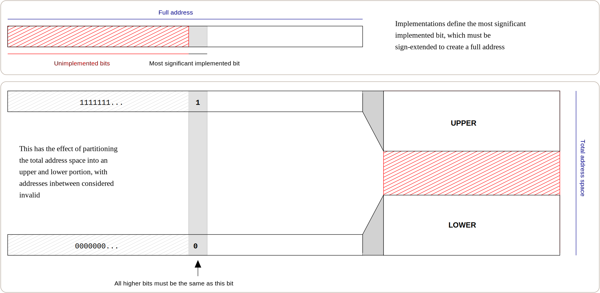

# 虛擬記憶體簡介

## 你所不知道的虛擬記憶體(Virtual memory)

虛擬記憶體通常被天真的認為是用硬碟的空間當作你額外的記憶體，這個記憶體是額外的，速度比較慢的電腦記憶體。也就是說，當我們電腦使用完記憶體之後，就會使用到硬碟上的虛擬記憶體。

在現代的電腦上，這個空間被稱為 swap space，因為這個機制是將沒有用到的記憶體內容儲存到硬碟之中，釋放出主記憶體(請記得，程式只能在主記憶體中執行)。

確實，把記憶體的內容交換到硬碟上面是一個重要的功能，但是你等等就會知道這個並不是虛擬記憶體的主要目的，這個特色只是虛擬記憶體意想不到的副作用。

## 虛擬記憶體是什麼？

虛擬記憶體就是使用地址空間的概念(address space)。

地址空間就是指處理器所有可以存取到的記憶體的可能範圍。這個地址空間受限於處理器的暫存器的大小限制，因為處理器的載入指令(load)需要輸入地址。也就是說 32bit 的處理器可以使用 `0x00000000`到`0xFFFFFFF`範圍內的地址，也就是大概4GB(2^32)的大小，所以 32bit 處理器可以載入儲存最大 4GB 的記憶體。

### 64 bit 處理器

現代新的處理器大概都是 64bit 的處理器，顧名思義，其暫存器有 64bit 。這個空間很大，大概有16EB。

> 1EB=1024PB
>
> 1PB=1024TB
>
> 1TB = 1024GB

64 bit 處理器是權衡之下的結果，因為64bit 處理器需要 8-byte pointers，程式的大小跟資料的大小的會因此增加，影響指令跟資料的快取表現。但是 64bit 處理器會有更多的暫存器，紓解了編譯器在暫存器不夠用的時候，會去存一些臨時的變數因應的情況。

### **Canonical Addresses**

雖然 64bit 處理器有 64bit 寬的暫存器，但是電腦不會實作這麼大的地址空間，因為現實中也沒有這麼大的實體記憶體可以給處理器存取。

所以大部分的處理器架構都會定義一個未實做(_unimplemented_)的地址空間，在x86-64 跟 Itanium 這兩個架構之下，都是定義最高有效位(MSB)必須是 sign-extended 才會是有效的地址。這就造成了有效的地址都被分成上下兩個部分，中間的部分都被當作不合法的地址，就跟下面這張圖想要表示的一樣。有效的地址被叫做 _canonical addresses，_無效的地址被叫做 _non_-canonical

<figure><figcaption>
這張圖再說明x86的架構下，地址的表示。MSB以上的叫做未實作(<em>unimplemented</em>)，未實作的bit都是用 sign-extended的方式填充。這就會造成要麻左手邊都是1，要麻左手邊都是0，這樣就恰恰好把地址空間切成上下兩個部分，中間紅色的是無效的地址空間。
</figcaption></figure>


為什麼叫做_canonical_？

我們可以把這個二進位看成線性代數的感覺，也就是

13(十進位) =  1101b = (1)\*2^3+(1)\*2^2+(0)\*2^1+(1)\*2^0 這樣

所以全部都是寫成矩陣的樣子就會是_canonical_ (線性代數的相關的專有名詞)


處理器想要知道MSB 這個 bit 是第幾位的時候，通常可以透過指令查詢。雖然說每一個架構都有不同的答案，但是大多都是第48個bit，也就是提供 256 TiB 的可用地址空間。

減少可用的地址空間也就代表處理器跟相關元件都可以節省儲存的空間，因為他們處理地址的時候不需要處理完整的 bit 位元。因為比MS還要高位元的bit是用signed-extended產生的，這樣就阻止了攜帶式的作業系統利用這些 bit 來儲存 flag 或是偷存自己的資訊，以確保未來擴充更多的地址空間的時候才可以保持相容。

## 使用地址空間

就跟作業系統大部分的組成元件一樣，虛擬記憶體就是使用地址空間的概念，將物理記憶體抽象化的展現。這就代表，當我們寫程式寫的地址的時候，這個地址不會是真實的、物理上的記憶體位置。

所以，程式裡使用的所有地址都是虛擬地址(_virtual_)，作業系統會幫你記錄這個虛擬地址位置是對應到哪一個真實的記憶體位置。當程式存取的某段記憶體的時候，處理器跟作業系統會一起把這個虛擬地址對應到真實的系統記憶體位置。
